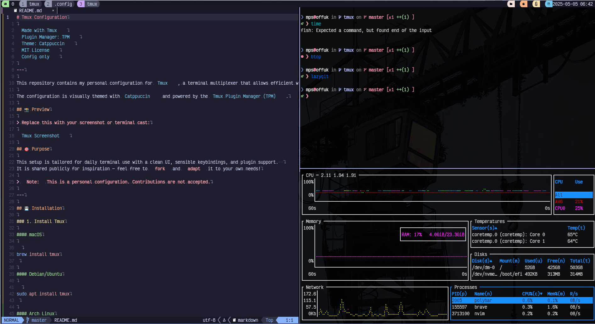

# Tmux Configuration


---

This repository contains my personal configuration for [Tmux](https://github.com/tmux/tmux), a terminal multiplexer that allows efficient window, pane, and session management from the command line.

The configuration is visually themed with [Catppuccin](https://github.com/catppuccin/tmux) and powered by the [Tmux Plugin Manager (TPM)](https://github.com/tmux-plugins/tpm).

## 📸 Preview

> Replace this with your screenshot or terminal cast:



## 🎯 Purpose

This setup is tailored for daily terminal use with a clean UI, sensible keybindings, and plugin support.  
It is shared publicly for inspiration — feel free to **fork** and **adapt** it to your own needs!

> **Note:** This is a personal configuration. Contributions are not accepted.

---

## 💾 Installation

### 1. Install Tmux

#### macOS

```bash
brew install tmux
```

#### Debian/Ubuntu

```bash
sudo apt install tmux
```

#### Arch Linux

```bash
sudo pacman -S tmux
```

### 2. Install TPM (Tmux Plugin Manager)

```bash
git clone https://github.com/tmux-plugins/tpm ~/.tmux/plugins/tpm
```

### 3. Clone this configuration

```bash
git clone https://github.com/MikePapaSierra/tmux ~/.config/tmux
```

Then symlink the `.tmux.conf`:

```bash
ln -s ~/.config/tmux/tmux.conf ~/.tmux.conf
```

Or directly copy it:

```bash
cp ~/.config/tmux/tmux.conf ~/.tmux.conf
```

### 4. Install plugins

Start Tmux, then press:

```text
Prefix (Ctrl-b by default) + I
```

This installs all plugins via TPM.

---

## 🧱 Structure

- `tmux.conf` — main configuration file
- `.config/tmux/` — repo location (if cloned this way)
- Uses TPM to manage plugins
- Includes embedded [Catppuccin](https://github.com/catppuccin/tmux) theme styling

---

## 🔧 Dependencies

- [Tmux](https://github.com/tmux/tmux) — required
- [TPM](https://github.com/tmux-plugins/tpm) — required for plugin management
- [Catppuccin Tmux Theme](https://github.com/catppuccin/tmux) — included or referenced

---

## 📎 License

This project is shared under the [MIT License](LICENSE), but primarily for reference. Fork freely!

